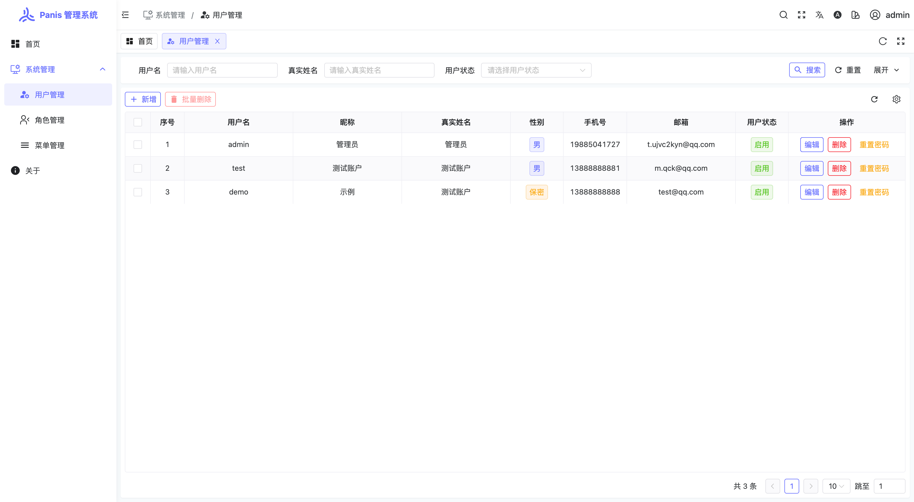
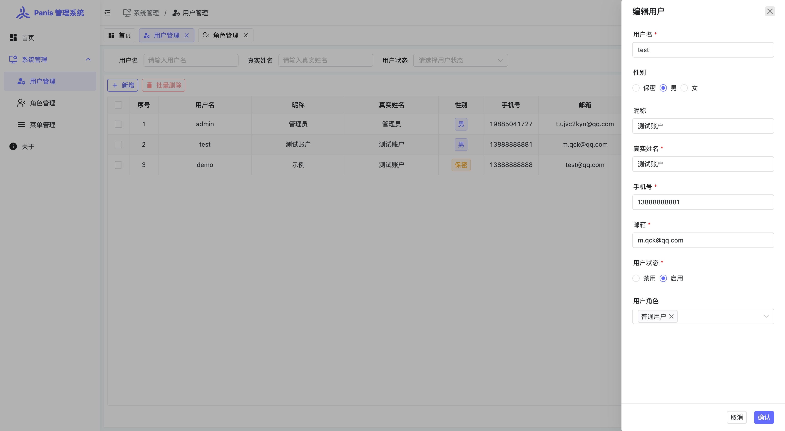
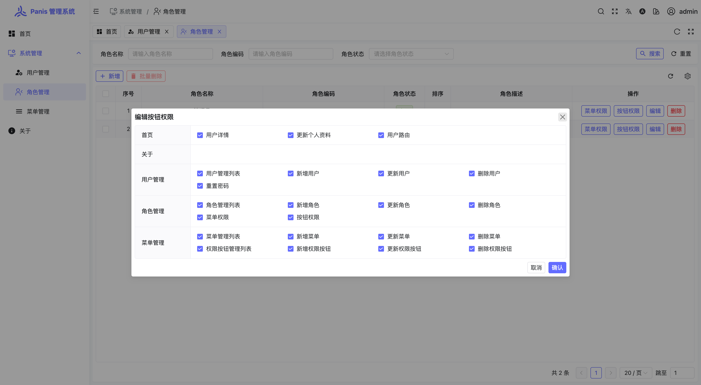
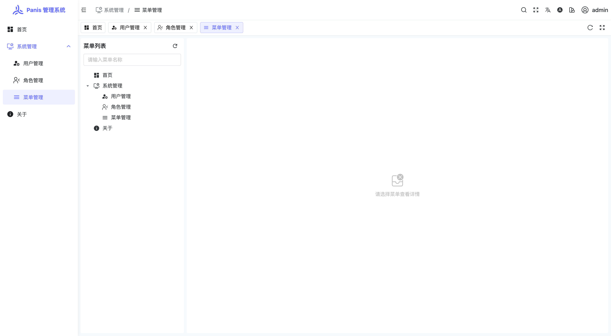
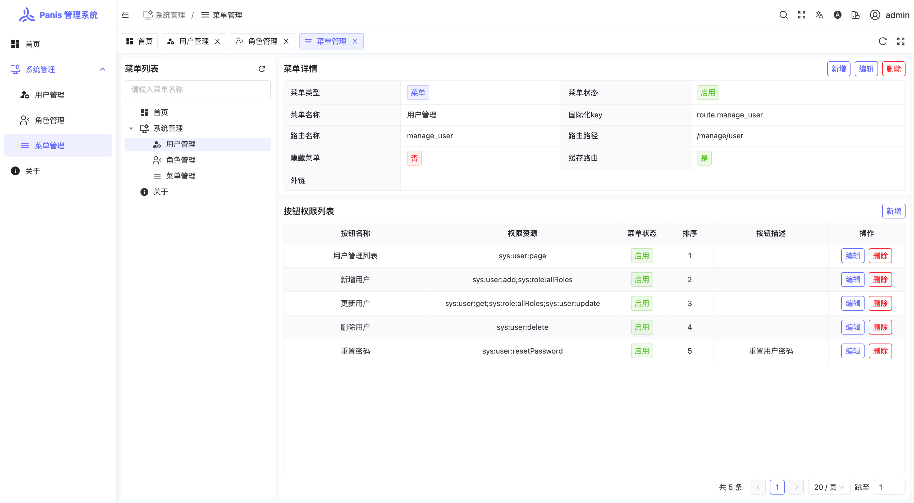
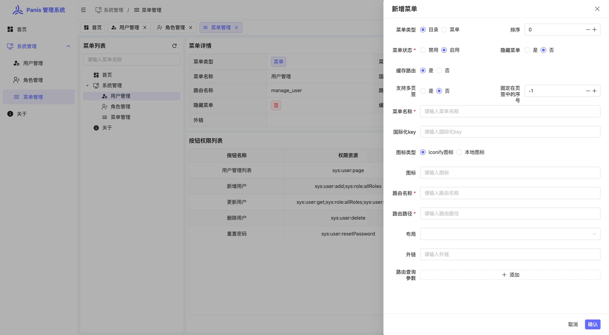
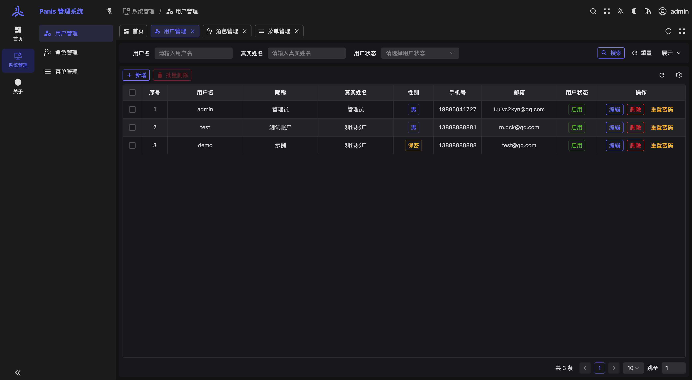
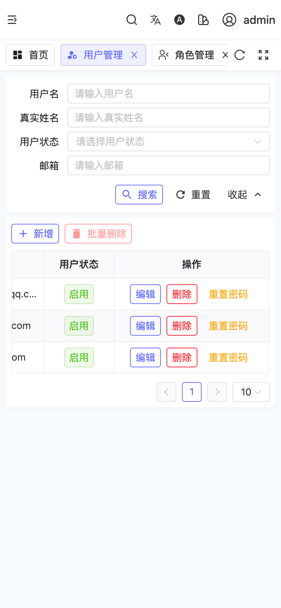
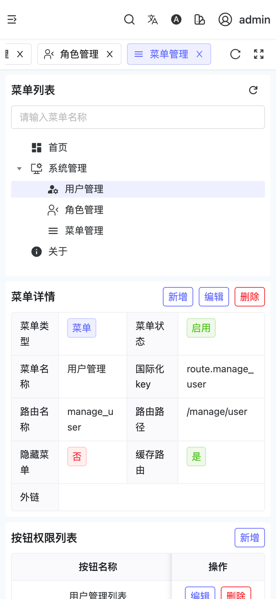
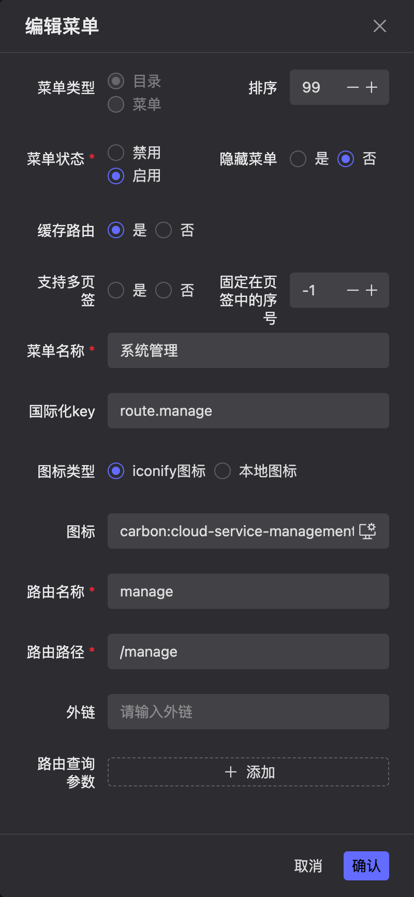

# PanisAdmin 后台管理系统


[](./LICENSE)
<br/>
[](https://github.com/paynezhuang)
[](https://github.com/paynezhuang)

### 项目简介

Panis: 名为 Pan , is Pan 反过来 `Panis`，同译为：面包。

[`PanisAdmin`](https://github.com/paynezhuang/panis-admin) 基于 [`SoybeanAdmin`](https://github.com/soybeanjs/soybean-admin) 二次修改而来。它是一个清新优雅、高颜值且功能强大的后台管理模板，采用`Naive UI`组件库，并最新的前端技术栈，包括 Vue3, Vite5, TypeScript, Pinia 和 UnoCSS。它内置了丰富的主题配置和组件，代码规范严谨，实现了自动化的文件路由系统。`PanisAdmin` 为您提供了一站式的后台管理解决方案，无需额外配置，开箱即用。同样是一个快速学习前沿技术的最佳实践。

在此特别感谢开源作者：[Soybean](https://github.com/honghuangdc) 。

### 项目特性

- **前沿技术应用**：采用 Vue3, Vite5, TypeScript, Pinia 和 UnoCSS 等最新流行的技术栈。
- **清晰的项目架构**：采用 pnpm monorepo 架构，结构清晰，优雅易懂。
- **严格的代码规范**：遵循 [SoybeanJS 规范](https://docs.soybeanjs.cn/zh/standard)，集成了eslint, prettier 和 simple-git-hooks，保证代码的规范性。
- **TypeScript**： 支持严格的类型检查，提高代码的可维护性。
- **丰富的主题配置**：内置多样的主题配置，与 UnoCSS 完美结合。
- **内置国际化方案**：轻松实现多语言支持。
- **自动化文件路由系统**：自动生成路由导入、声明和类型。更多细节请查看 [Elegant Router](https://github.com/soybeanjs/elegant-router)。
- **灵活的权限路由**：同时支持前端静态路由和后端动态路由。
- **丰富的页面组件**：内置多样页面和组件，包括403、404、500页面，以及布局组件、标签组件、主题配置组件等。
- **命令行工具**：内置高效的命令行工具，git提交、删除文件、发布等。
- **移动端适配**：完美支持移动端，实现自适应布局。

### 项目源码

| 名称      | 链接                                                                      |
|:--------|:------------------------------------------------------------------------|
| 前端      | [Panis-admin](https://github.com/paynezhuang/panis-admin)               |
| 后端      | [Panis-boot](https://github.com/paynezhuang/panis-boot)                 |
| 后端扩展依赖库 | [Panis-boot-starter](https://github.com/paynezhuang/panis-boot-starter) |

### 项目启动

##### 前置环境

- **Git**: 你需要git来克隆和管理项目版本。
- **NodeJS**: >=18.12.0，推荐 18.19.0 或更高。
- **pnpm**: >= 8.7.0，推荐 8.14.0 或更高。

##### 克隆项目

```bash
git clone https://github.com/paynezhuang/panis-admin.git
```

##### 项目启动

1. 安装依赖
```bash
pnpm i
```
> 由于本项目采用了 pnpm monorepo 的管理方式，因此请不要使用 npm 或 yarn 来安装依赖。

2. 启动项目，修改`.env.test`中`VITE_SERVICE_BASE_URL`对应的后端地址
```bash
pnpm dev
```

##### 构建项目

修改`.env.prod`中`VITE_SERVICE_BASE_URL`对应的后端地址

```bash
pnpm build
```

### Git 提交规范

本项目已内置 `commit` 命令，您可以通过执行 `pnpm commit` 来生成符合 [Conventional Commits]([conventionalcommits](https://www.conventionalcommits.org/)) 规范的提交信息。在提交PR时，请务必使用 `commit` 命令来创建提交信息，以确保信息的规范性。


### 示例图片


|  |  |
|--------------------------------|--------------------------------|
|  |  |
|  |  |
|  |  |
|  | |
|  |  |
|  | |

### 浏览器支持

推荐使用最新版的 Chrome 浏览器进行开发，以获得更好的体验。

| [](http://godban.github.io/browsers-support-badges/) | [](http://godban.github.io/browsers-support-badges/) | [](http://godban.github.io/browsers-support-badges/) | [](http://godban.github.io/browsers-support-badges/) | [](http://godban.github.io/browsers-support-badges/) |
| --- | --- | --- | --- | --- |
| not support | last 2 versions | last 2 versions | last 2 versions | last 2 versions |

### 特别鸣谢

- [SoybeanJS](https://github.com/soybeanjs)
- [Naive UI](https://www.naiveui.com/zh-CN/os-theme)
- [Vue](https://cn.vuejs.org/)
- 不一一列举，感谢所有开源项目的贡献者

### 开源协议

项目基于 [Apache License 2.0 © 2024 Zhuang Pan](./LICENSE) 协议，仅供学习参考，商业使用请遵循作者版权信息，作者不保证也不承担任何软件的使用风险。
